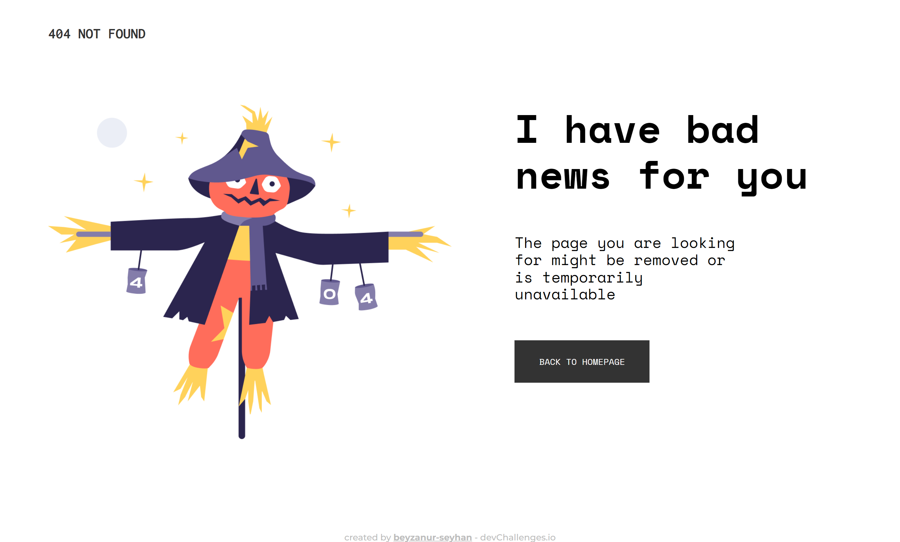
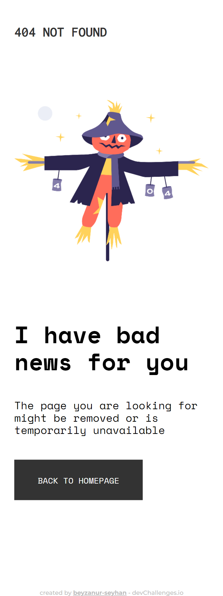

<!-- Please update value in the {}  -->

<h1 align="center">404 PAGE CHALLENGE</h1>

   Solution for a challenge from  <a href="http://devchallenges.io" target="_blank">Devchallenges.io</a>.

  <h3>
    <a href="https://beyzanur-seyhan.github.io/404-page-challenge/">
      Demo
    </a>
     | 
    <a href="https://devchallenges.io/solutions/EewEnNJqo0sEoicv99rN">
      Solution
    </a>
     | 
    <a href="https://devchallenges.io/challenges/wBunSb7FPrIepJZAg0sY">
      Challenge
    </a>
  </h3>

<!-- TABLE OF CONTENTS -->

## Table of Contents

- [Overview](#overview)
  - [Built With](#built-with)
- [Features](#features)
- [Contact](#contact)

<!-- OVERVIEW -->

## Overview

### ▶️ Desktop View

### ▶️ Mobile View

- [Live Demo ▶️](https://beyzanur-seyhan.github.io/404-page-challenge/)
- [Solution ▶️](https://devchallenges.io/solutions/EewEnNJqo0sEoicv99rN)

### Built With

- [SASS](https://sass-lang.com/)

## Features

This application/site was created as a submission to a [DevChallenges](https://devchallenges.io/challenges) challenge. The [challenge](https://devchallenges.io/challenges/wBunSb7FPrIepJZAg0sY) was to build an application to complete the given user stories.

## Contact

- Website [beyzanurseyhan.com](https://beyzanurseyhan.com)
- GitHub [@your-username](https://github.com/beyzanur-seyhan)
- Linkedin [@beyzanurseyhan](https://linkedin.com/beyzanurseyhan)
- E-Mail [info@beyzanurseyhan.com](mailto:info@beyzanurseyhan.com)
